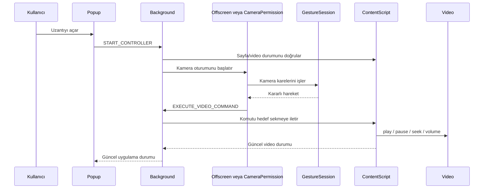

# Mimari Notları

## Bileşen Sorumlulukları

- `background/index.ts`
  - aktif sekme ve hedef video sekmesi durumunu saklar
  - uzantı rozetini günceller
  - popup, offscreen/camera-permission ve content script arasındaki mesajları yönlendirir
  - gerektiğinde `offscreen/offscreen.html` belgesini açar veya kapatır
  - görünür kamera izin sekmesi kapanırsa kontrol durumunu temizler

- `popup/popup.ts`
  - ana kullanıcı arayüzünü yönetir
  - hedef sekme durumunu, kamera durumunu, hareket durumunu ve ayarları gösterir
  - kontrolü başlatır/durdurur
  - kamera izni hazır değilse önce yerel izin denemesi yapar, engellenirse görünür izin akışını başlatır

- `offscreen/offscreen.ts`
  - normal akışta kamera oturumunu arka planda çalıştırır
  - `GestureSession` çıktısını background durumuna yansıtır
  - kararlı hareket komutlarını hedef video sekmesine iletilmek üzere background'a gönderir

- `camera-permission/camera-permission.ts`
  - Chrome kamera iznini görünür sekmede almak için yedek akıştır
  - kullanıcı bu sayfada kontrolü durdurursa background stop akışını çağırır
  - sekme kapanırsa background hedef durumu temizler

- `content/content-script.ts`
  - sayfa başına tek kez başlatılır; tekrar enjekte edilirse sentinel ile ikinci bootstrap engellenir
  - video durumunu background'a raporlar
  - overlay durumunu günceller
  - medya komutlarını `VideoController` üzerinden uygular

- `gesture/session.ts`
  - MediaPipe el ve yüz modellerini başlatır
  - hareketleri kararlı komutlara çevirir
  - bakış/göz korumalarını uygular

## Komut Akışı

## Durum Temizleme

- Hedef video sekmesi kapanırsa `stopController()` çalışır ve overlay gizlenir.
- Görünür kamera izin sekmesi kapanırsa background kontrol durumunu temizler.
- Content script tekrar enjekte edilirse ikinci overlay, ikinci interval veya ikinci mesaj dinleyicisi oluşturulmaz.

## Genişletme Yolu

- Yeni kullanıcı hareketleri `gesture/session.ts` içinde mevcut komut tiplerine eşlenmelidir.
- Yeni medya komutları önce `shared/types.ts` ve `content/video-controller.ts` içinde desteklenmelidir.
- UI'da yalnızca gerçekten tetiklenebilen ayarlar gösterilmelidir.
